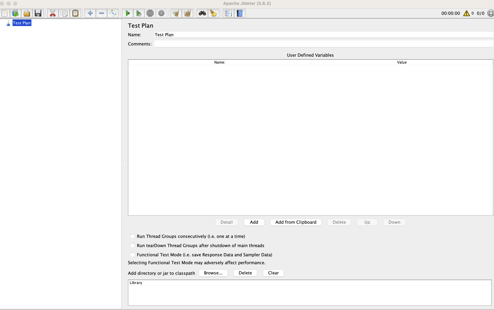
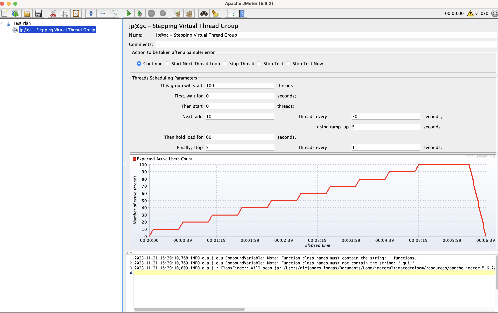
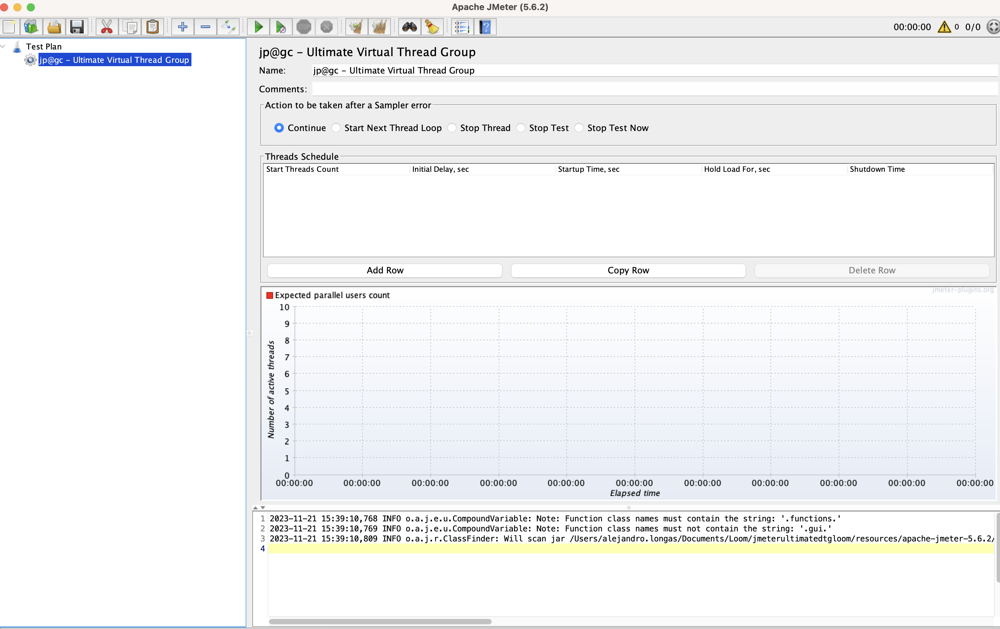

# JMeter Ultimate Virtual Thread Group Plugin

<h1 align="center"></h1>

The JMeter Ultimate Virtual Thread Group Plugin is a Fork from https://github.com/undera/jmeter-plugins.

The goal of this repo is implements the New schema of threads introduced in Java 21 on the Stepping Thread Group and The Ultimate Thread Group.

## Java 21 Virtual Threads: ##  

Java Virtual Threads (Project loom), introduced in Java 21, are lightweight threads provided by the Java platform. Unlike traditional threads, virtual threads are managed by the Java Virtual Machine (JVM) and are intended to be more efficient and scalable.

## JDK 21 Dependency

This project requires **JDK 21 or higher**. Before proceeding, make sure you have JDK 21 installed on your system.

All this lab was performed using AWS Corretto, you can downloaded from: https://docs.aws.amazon.com/corretto/latest/corretto-21-ug/downloads-list.html

Or downloaded it from the official Oracle website or use an OpenJDK distribution.

## Building from Source

This step is optional to use this JMeter plugin, follow these steps:

1. Clone the repository to your local machine:
   ```shell
   git clone git@github.com:ahlongas07/jmeterultimatedtgloom.git
   ```

2. Navigate to the project directory:
   ```shell
   cd jmeterultimatedtgloom
   ```

3. Build the project using Maven:
   ```shell
   mvn clean package dependency:copy-dependencies
   ```

4. After a successful build, you will find the compiled JAR file in the `target/` directory.

5. Copy the generated JAR file: `jmeter-virtual-thread-group-loom-project-1.0` from the `target/` to the JMeter `lib/ext/` directory and copy `jmeter-plugins-cmn-jmeter-0.7.jar` from [Resources Page](https://github.com/ahlongas07/jmeterultimatedtgloom/tree/master/resources).

## Starting the Plugin in JMeter

If you don't want compile the extension, just download it from [Resources Page](https://github.com/ahlongas07/jmeterultimatedtgloom/tree/master/resources).

1. Copy `jmeter-virtual-thread-group-loom-project-1.0` to `lib/ext/` and copy `jmeter-plugins-cmn-jmeter-0.7.jar` to `lib/`

2. If you are having problems, download my JMeter version from [Resources Page](https://github.com/ahlongas07/jmeterultimatedtgloom/tree/master/resources)

## Using the Plugin in JMeter

1. Give the enough permission to the jmeter file in `bin/` directory.

   ```shell
   sudo chmod +x jmeter
   ```

2. Start Jmeter

   ```shell
   sudo ./jmeter   
   ```


3. Now you can use the plugin in your JMeter test plans by adding the elements to your test plan.





Special thanks to [Pedro Jara](https://github.com/pedrojara2405) for the guide and the support.
